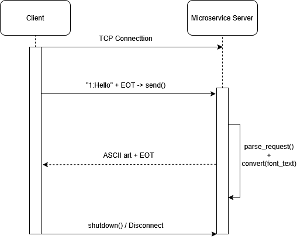

# CS-361-Text-Converter
Microservice for the Winter 2026 Ecampus CS361 group project assignment.

## Overview

The microservice listens on 'localhost:54325' using TCP. Clients then connet, send request strings, and recieve back the converted ASCII art.

### Request Format

Send a message with the following format:

```
<font_number>:<text_to_convert><EOT>
```

- `<font_number>` — integer specifying the font. Currently only `1` (Big Money NE) is supported.
- `<text_to_convert>` — ASCII text (A–Z, case-insensitive) to convert into bubble letters.
- `<EOT>` — ASCII End of Transmission character (byte value `0x04`). Signals end of the request.

### Response Format

The server responds with the rendered ASCII art:

```
<ascii_art_text><EOT>
```

## Requesting Data

Connect to the server and send the formatted request string. This example sends `HELLO` using font `1`: 

```c
// Connect to the server 
int server_socket = connect_to_server(); // connects to localhost:54325

// Build the request: "1:HELLO" + EOT character
char request[] = "1:HELLO";
int len = strlen(request);
request[len+1] = '\0'; // null terminator

// Send the request
send(server, request, len + 1, 0);
```

## Receiving Data

The server sends the converted ASCII art back, followed by an EOT character (`0x04`). Read until you encounter the EOT byte, then strip it to get the final string.

```c
char* bubble_letters;
// recieve_message reads until EOT, strips it, and stores the result
int result = recieve_message(server_socket, &bubble_letters);
if (result == 0) {
    printf("%s\n", bubble_letters); // print the ASCII art
    free(bubble_letters);
}
shutdown(server_socket, SHUT_RDWR);
```



## Running the Server

```bash
gcc -o server server.c
./server
```

The server will print `Waiting for requests...` and continue running, accepting one client at a time.


## Running the Test Client

```bash
gcc -o test_client test_client.c
./test_client "1:HELLO"
```
The test client sends the provided argument to the server and prints the returned ASCII art.
